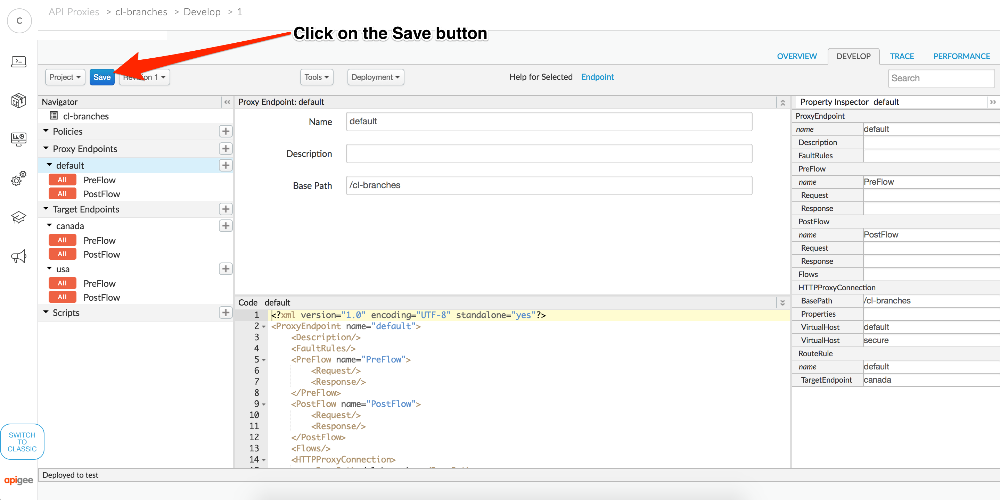
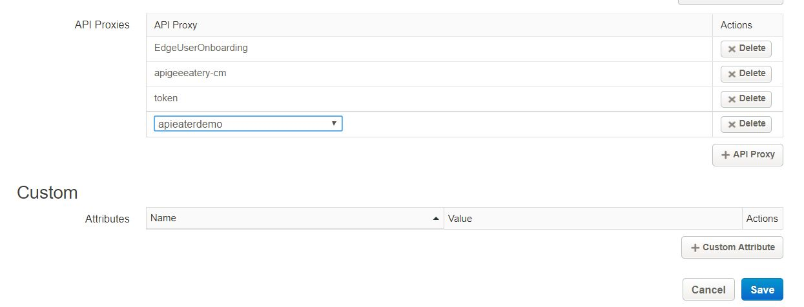

# API Development : Using Shared Flows

*Duration : 30 mins*

*Persona : API Team*

# Use case

You can combine policies and resources into a shared flow that you can consume from multiple API proxies, and even from other shared flows. Although it's like a proxy, a shared flow has no endpoint. It can be used only from an API proxy or shared flow that's in the same organization as the shared flow itself.

By capturing in one place functionality that's useful in multiple places, a shared flow helps you ensure consistency, shorten development time, and more easily manage code.

# How can Apigee Edge help?

Imagine you have areas of functionality that are either used in multiple places or must be standardized across APIs in your organization. You could have a shared flow for each category, including:

- security, with authorization code using OAuth and API key verification, as well as threat protection code.
- logging, for generating standard error messages.

# Context

In this lab, we'll try building shared flow by de -coupling some of the security verification out of apieaterydemo API proxy which we have built earlier

# Pre-requisites

None

# Instructions

* Go to [https://apigee.com/edge](https://apigee.com/edge) and log in. This is the Edge management UI. 

## Create a new Shared Flow

* Open the Develop Menu from the left hand side navigation bar then click on the Shared Flow menu item.


* Click on the + Shared Flow button in the upper right corner of the Shared Flow list panel


* Create a new shared flow "securityFlow"


## Add policy to shared flow

* From the Shared Flow Overview, click on the Develop tab to open the proxy editor. 


* Click on add step to create verify API key policy


* Add verify API key policy "SE-verifyApiKey"


* Click on add step to add KVM policy


* Add extract KVM operation policy "ME-LookupClientCredentials"


* Update "ME-LookupClientCredentials" properties as below to extract key value parameters from "apieaterycredentials" KVM


```
<?xml version="1.0" encoding="UTF-8" standalone="yes"?>
<KeyValueMapOperations async="false" continueOnError="false" enabled="true" name="ME-LookupClientCredentials" mapIdentifier="apieaterycredentials">
    <DisplayName>ME-LookupClientCredentials</DisplayName>
    <Properties/>
    <ExclusiveCache>false</ExclusiveCache>
    <ExpiryTimeInSecs>300</ExpiryTimeInSecs>
    <Get assignTo="private.username" index="1">
        <Key>
            <Parameter>username</Parameter>
        </Key>
    </Get>
    <Get assignTo="private.password" index="1">
        <Key>
            <Parameter>password</Parameter>
        </Key>
    </Get>
    <Scope>environment</Scope>
</KeyValueMapOperations>
```

* Click on add step to add basic authentication policy


* Add extract KVM operation policy "BA-backendAuthentication"


* Updated "BA-backendAuthentication" to update request header parameter for backend call


```
<?xml version="1.0" encoding="UTF-8" standalone="yes"?>
<BasicAuthentication async="false" continueOnError="false" enabled="true" name="BA-backendAuthentication">
    <DisplayName>BA-backendAuthentication</DisplayName>
    <Operation>Encode</Operation>
    <IgnoreUnresolvedVariables>false</IgnoreUnresolvedVariables>
    <User ref="private.username"/>
    <Password ref="private.password"/>
    <AssignTo createNew="false">request.header.Authorization</AssignTo>
    <Source>request.header.Authorization</Source>
</BasicAuthentication>
```
* Save the shared flow changes



* Deploy the shared flow in "test" environment


## Use Flow Callout policy in "{your initials}-apieaterydemo" API to call securityFlow

* Click on API Proxies and naviagate to "apieaterydemo" proxy and click in develop


* Click on "ME-LookupClientCredentials" policy on your left


* Update from enabled=true to enabled=false


```
<?xml version="1.0" encoding="UTF-8" standalone="yes"?>
<KeyValueMapOperations async="false" continueOnError="false" enabled="false" name="ME-LookupClientCredentials" mapIdentifier="apieaterycredentials">
    <DisplayName>ME-LookupClientCredentials</DisplayName>
    <Properties/>
    <ExclusiveCache>false</ExclusiveCache>
    <ExpiryTimeInSecs>300</ExpiryTimeInSecs>
    <Get assignTo="private.username" index="1">
        <Key>
            <Parameter>username</Parameter>
        </Key>
    </Get>
    <Get assignTo="private.password" index="1">
        <Key>
            <Parameter>password</Parameter>
        </Key>
    </Get>
    <Scope>environment</Scope>
</KeyValueMapOperations>
```

* Click on "BA-backendAuthentication" policy on your left


* Update from enabled=true to enabled=false


```
<?xml version="1.0" encoding="UTF-8" standalone="yes"?>
<BasicAuthentication async="false" continueOnError="false" enabled="false" name="BA-backendAuthentication">
    <DisplayName>BA-backendAuthentication</DisplayName>
    <Operation>Encode</Operation>
    <IgnoreUnresolvedVariables>false</IgnoreUnresolvedVariables>
    <User ref="private.username"/>
    <Password ref="private.password"/>
    <AssignTo createNew="false">request.header.Authorization</AssignTo>
    <Source>request.header.Authorization</Source>
</BasicAuthentication>
```

* Add Flow Callout policy


* Add flow callout policy "EX-callSecurityFlow" and select shared flow securityFlow from drop down menu


## Update product that we have created in earlier labs session, ref:Lab 4 API Security - Securing APIs with API Keys

* Navigate to Publish--> Product and select the product which we have created in earlier labs session


* Click on Edit button


* Add  {your initials}-apieaterdem to the apiproxy and save


## Test Apigee


* Click on the Start Trace Session button


* Now make another API call using your apikey and "/chefs" path suffix.

```
http://{{youHostName}/{your initials}-apieaterdemo/chefs?apikey=Wcq0S7AyPm6AcfTotWazH954TF3yCLG7
```


On examining the trace you can notice that flow callout is invoked from API proxy and shared flow verfied API key, extracted backend credentials.

# Summary

This lab we have develope and tested shared flow by decoupling the security flow policies from the proxy flow. Also a shared flow can be developed and managed by a team responsible for broad company policies, then consumed in proxies by line-of-business teams building more specialized apps.

# References

[Shared Flow](https://docs.apigee.com/api-services/content/shared-flows)


