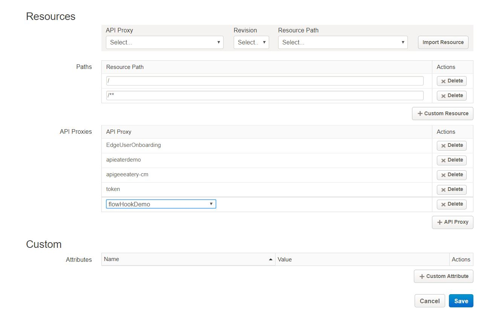

# API Development : Using Flow hooks

*Duration : 30 mins*

*Persona : API Team*

# Use case

You can have shared flows perform boilerplate request pre-processing or response post-processing across a set of APIs. With a flow hook, you attach a shared flow so that it executes at the same place for all API proxies deployed to a specific environment. This gives you a separately implemented and deployed sequence of logic that is not part of a proxy's implementation code.

# How can Apigee Edge help?

For example, imagine that you have one team managing a single set of security requirements for multiple teams that represent different lines of businesses (LOBs). Each LOB team can develop APIs according to their own requirements, and without needing to account for the broader security requirements. The security team can implement those security requirements in a shared flow, then attach the flow to the Apigee Edge environment using a flow hook. Because the shared flow isn't part of proxy code, the security team can revise it as needed without interfering with LOB code.

Shared flows attached via flow hooks execute at that position for every API proxy deployed to the proxy hook's environment. For this reason, the ability to use flow hooks is available only to administrators of an Apigee Edge org.

# Context

In this lab, we'll try building flow hooks by de -coupling some of the security verification out of apieaterydemo API proxy which we have built earlier

# Pre-requisites

None

# Instructions

* Go to [https://apigee.com/edge](https://apigee.com/edge) and log in. This is the Edge management UI. 

## Create a new Shared Flow, If this is already done as part of Lab 10: Shared flow then skip next section "Add shared flow to flowhooks"

* Open the Develop Menu from the left hand side navigation bar then click on the Shared Flow menu item.


* Click on the + Shared Flow button in the upper right corner of the Shared Flow list panel


* Create a new shared flow "securityFlow"


## Add policy to shared flow

* From the Shared Flow Overview, click on the Develop tab to open the proxy editor. 


* Click on add step to create verify API key policy


* Add verify API key policy "SE-verifyApiKey"


* Click on add step to add KVM policy


* Add extract KVM operation policy "ME-LookupClientCredentials"


* Update "ME-LookupClientCredentials" properties as below to extract key value parameters from "apieaterycredentials" KVM


```
<?xml version="1.0" encoding="UTF-8" standalone="yes"?>
<KeyValueMapOperations async="false" continueOnError="false" enabled="true" name="ME-LookupClientCredentials" mapIdentifier="apieaterycredentials">
    <DisplayName>ME-LookupClientCredentials</DisplayName>
    <Properties/>
    <ExclusiveCache>false</ExclusiveCache>
    <ExpiryTimeInSecs>300</ExpiryTimeInSecs>
    <Get assignTo="private.username" index="1">
        <Key>
            <Parameter>username</Parameter>
        </Key>
    </Get>
    <Get assignTo="private.password" index="1">
        <Key>
            <Parameter>password</Parameter>
        </Key>
    </Get>
    <Scope>environment</Scope>
</KeyValueMapOperations>
```

* Click on add step to add basic authentication policy


* Add extract KVM operation policy "BA-backendAuthentication"


* Updated "BA-backendAuthentication" to update request header parameter for backend call


```
<?xml version="1.0" encoding="UTF-8" standalone="yes"?>
<BasicAuthentication async="false" continueOnError="false" enabled="true" name="BA-backendAuthentication">
    <DisplayName>BA-backendAuthentication</DisplayName>
    <Operation>Encode</Operation>
    <IgnoreUnresolvedVariables>false</IgnoreUnresolvedVariables>
    <User ref="private.username"/>
    <Password ref="private.password"/>
    <AssignTo createNew="false">request.header.Authorization</AssignTo>
    <Source>request.header.Authorization</Source>
</BasicAuthentication>
```
* Save the shared flow changes


* Deploy the shared flow in "test" environment


## Add shared flow to flowhooks

* Navigate to Admin--> Environment and select 'test' environment


* Add shared flow "securityFlow" to PREFLOW flowhooks and click Save


## Create API proxy "{your initials}-flowHookDemo" API to call securityFlow

* Open the Develop Menu from the left hand side navigation bar then click on the API Proxies menu item.


* Click on the +Proxy button in the upper right corner of the API proxy list panel


* Enter values for Proxy Name, Proxy Base Path and Existing API. Click Next.


```
Proxy Name: {your initials}-flowHookDemo
Proxy Base Path: /{your initials}-flowHookDemo
Existing API: http://apigee-edu-prod.apigee.net:80/v1/apieatery
```

* Select the pass through option for Authorization then click Next.


* Accept all the default values for the Virtual Host configuration then click Next.


* Accept all the default values for the final configuration confirmation, then click Next.


* When the confirmation displays, click on the proxy name link to open a detailed view of your API proxy.

## Update product that we have created in earlier labs session, ref:Lab 4 API Security - Securing APIs with API Keys

* Navigate to Publish--> Product and select the product which we have created in earlier labs session


* Click on Edit button


* Add  {your initials}-flowHookDemo to the apiproxy and save



## Test Apigee


* Click on the Start Trace Session button


* Now make another API call using your apikey and "/chefs" path suffix.

```
http://{{youHostName}/{your initials}-flowHookDemo/chefs?apikey=Wcq0S7AyPm6AcfTotWazH954TF3yCLG7
```


On examining the trace you can notice that flow hook [FH] is invoked from API proxy and as part of that shared flow invoked verfied API key, extracted backend credentials.

# Summary

In this lab we have built and tested shared flow by decoupling the security policies from the APi proxy. A shared flow can be developed and managed by a team responsible for broad company policies, then consumed in proxies by line-of-business teams building more specialized apps.

# References

[Shared Flow](https://docs.apigee.com/api-services/content/shared-flows)


