# API Development : Working with Key Value Maps

*Duration : 30 mins*

*Persona : API Team*

# Use case

You want to store credentials, private keys, or tokens—like tokens for external services , credentials required to generate OAuth tokens, or private keys used in Java Callouts or JavaScript for encryption or JSON Web Token (JWT) signing. Instead of passing credentials, keys, or tokens in the request, or hard-coding them in your proxy logic, you can store them in a KVM (always encrypted) and dynamically retrieve them in calls to targets that require them.

# How can Apigee Edge help?

There are times when you want to store data for retrieval at runtime—non-expiring data that shouldn't be hard-coded in your API proxy logic. Key value maps (KVMs) are ideal for this. A KVM is a custom collection of key/value String pairs that is either encrypted or unencrypted. 

# Context

In this lab, we'll build a API proxy with invokes a secure backend by passing authorization parameters in the header when invoking backend url. The credetials used fpor authorizing backend API call are stored in secured Key Value Map (KVM) and we will be retriving the credentials from KVM and used that for creating basic authentication header for backend API call.

At end of this you will know
- What is Key Value Map
- How to create a Key value maps
- How to enable encryption on KVMs
- How to retrive encrypted KVMs in an API proxy
- referring encrypted KVM parameters in basic authentication policy
- Invoking an encrypted backend API

# Pre-requisites

None

# Instructions

* Go to [https://apigee.com/edge](https://apigee.com/edge) and log in. This is the Edge management UI. 

## Create a new Kev Value Map

* Open Setting Menu, click on environment and select Key Value Map.

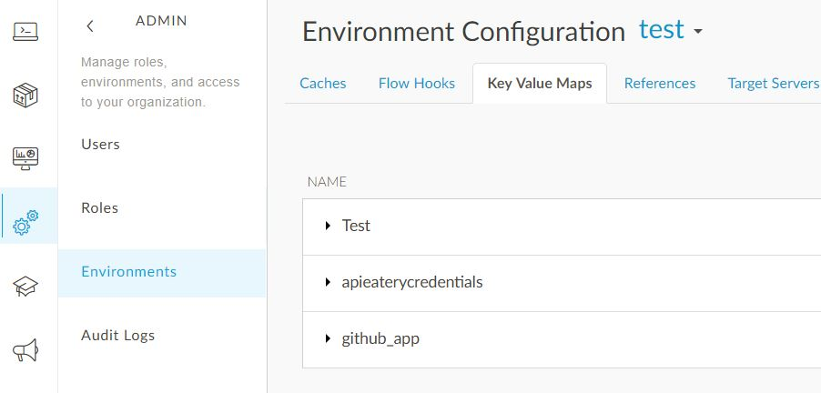

* Create new key value map with name 'apieaterycredentials' and click 'encrypted' check box

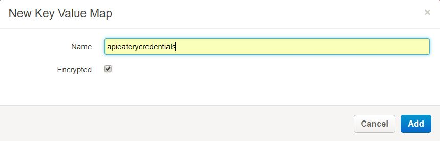

* Add new map entry with name 'username' and value 'foundationUser'

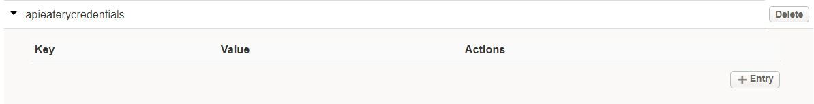

* Add new map entry name 'password' with value 'Test1234'

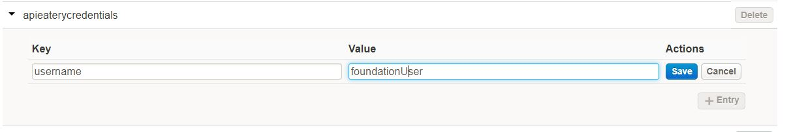

## Create a new API Proxy

* Open the Develop Menu from the left hand side navigation bar then click on the API Proxies menu item.


* Click on the +Proxy button in the upper right corner of the API proxy list panel


* In the new proxy creation wizard, select the Reverse Proxy option and then click on Next

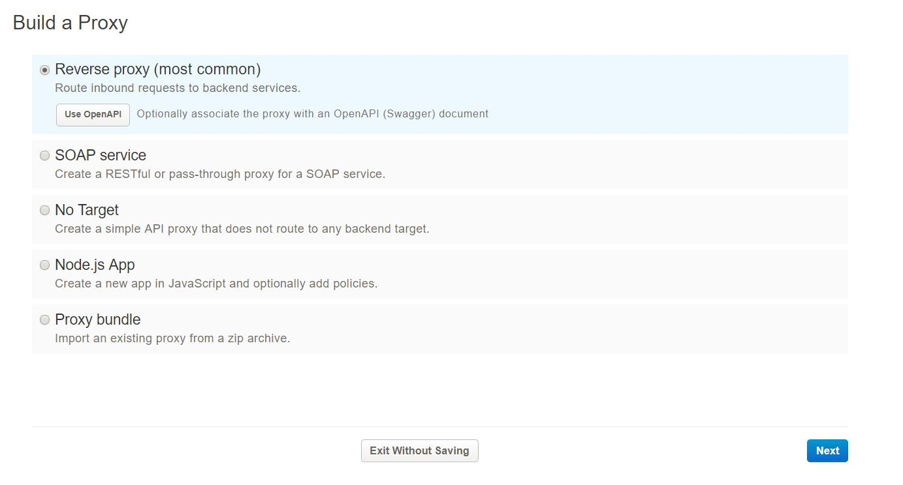

* Enter values for Proxy Name, Proxy Base Path and Existing API. Click Next.

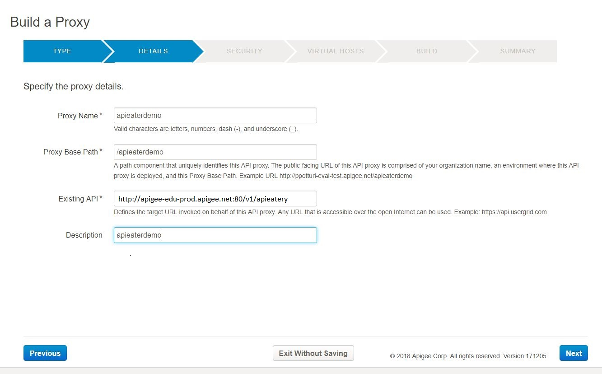

```
Proxy Name: {your initials}-apieaterydemo
Proxy Base Path: /{your initials}-apieaterydemo
Existing API: http://apigee-edu-prod.apigee.net:80/v1/apieatery
```

* Select the pass through option for Authorization then click Next.


* Accept all the default values for the Virtual Host configuration then click Next.

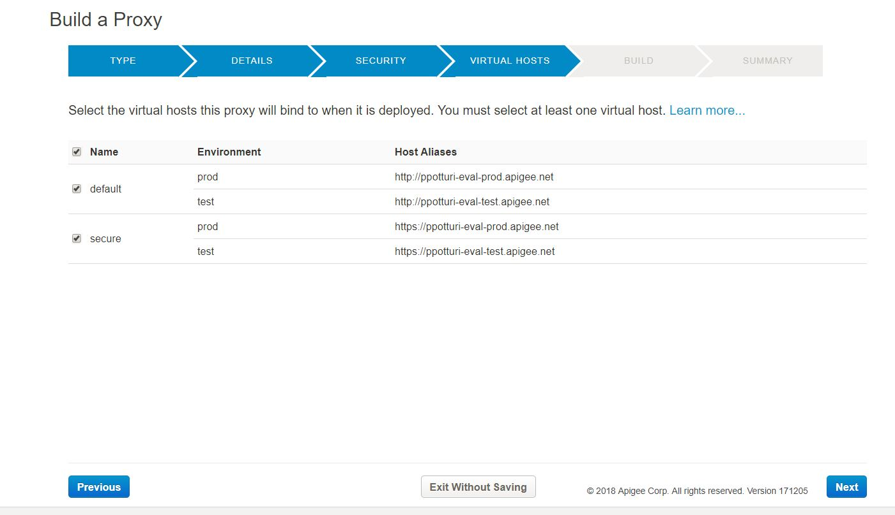

* Accept all the default values for the final configuration confirmation, then click Next.

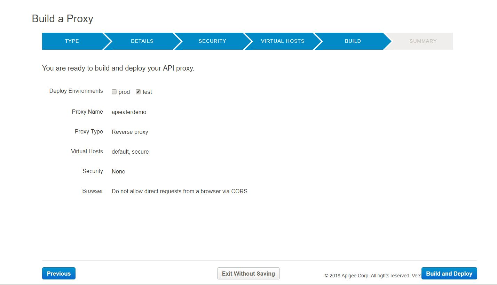

* When the confirmation displays, click on the proxy name link to open a detailed view of your API proxy.

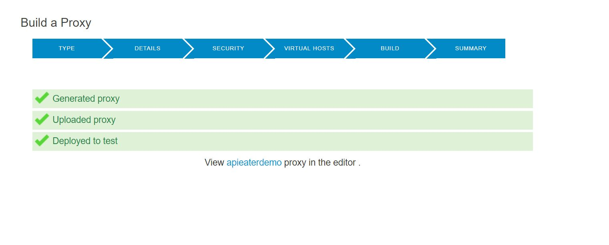

## Retrive KVM in API proxy

* Click on the develop tab on api proxy and click on default under proxy endpoint. And select KVM policy from the drop down "ME-lookupClientCredentials" then click on Add button as show below

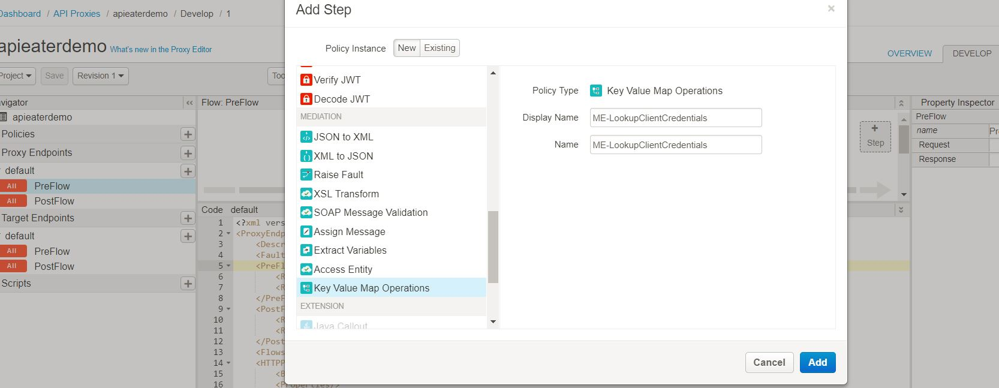

* Change the name of Map Identifier to 'apieaterycredentials'

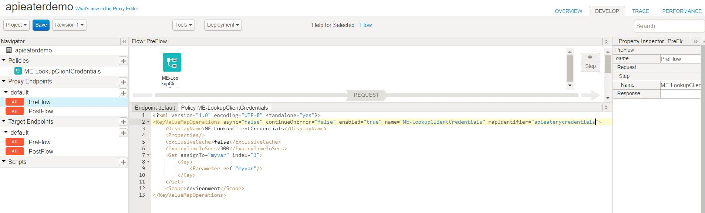

* Extract map value from key value map 'apieaterycredentials' and assing it to local variable. IMP NOTE: If a key value map is encrypted, retrieve values by using the "private." prefix in the assignTo attribute value
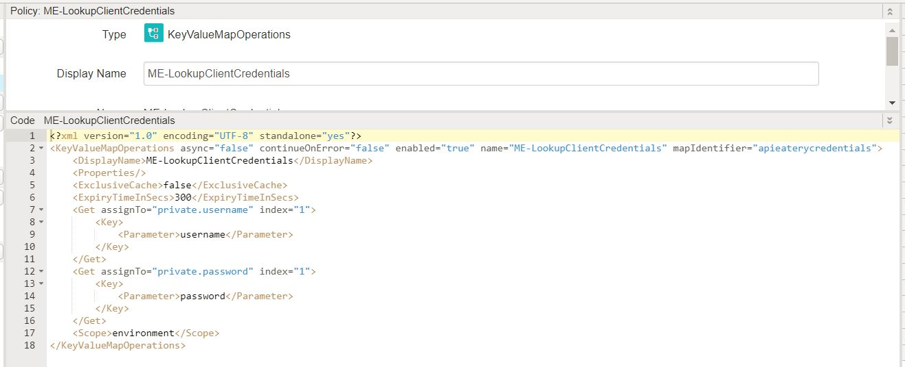

```
<?xml version="1.0" encoding="UTF-8" standalone="yes"?>
<KeyValueMapOperations async="false" continueOnError="false" enabled="true" name="ME-LookupClientCredentials" mapIdentifier="apieaterycredentials">
    <DisplayName>ME-LookupClientCredentials</DisplayName>
    <Properties/>
    <ExclusiveCache>false</ExclusiveCache>
    <ExpiryTimeInSecs>300</ExpiryTimeInSecs>
    <Get assignTo="private.username" index="1">
        <Key>
            <Parameter>username</Parameter>
        </Key>
    </Get>
    <Get assignTo="private.password" index="1">
        <Key>
            <Parameter>password</Parameter>
        </Key>
    </Get>
    <Scope>environment</Scope>
</KeyValueMapOperations>
```

## Add Basic Authentication policy

* In TARGET ENDPOINT PRE-FLOW Add Basic Authentication policy "BA-backendAuthentication". 

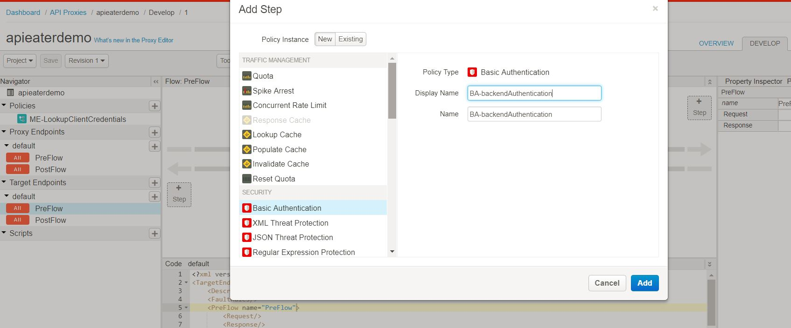

* Refer KVM parameters "private.username" and "private.password", which we have retrived in previous step ME-lookupClientCredentials policy

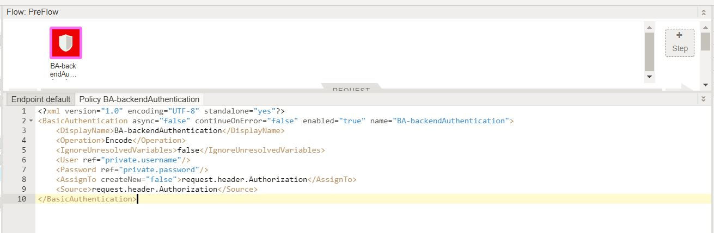

```
<?xml version="1.0" encoding="UTF-8" standalone="yes"?>
<BasicAuthentication async="false" continueOnError="false" enabled="true" name="BA-backendAuthentication">
    <DisplayName>BA-backendAuthentication</DisplayName>
    <Operation>Encode</Operation>
    <IgnoreUnresolvedVariables>false</IgnoreUnresolvedVariables>
    <User ref="private.username"/>
    <Password ref="private.password"/>
    <AssignTo createNew="false">request.header.Authorization</AssignTo>
    <Source>request.header.Authorization</Source>
</BasicAuthentication>
```
## Test you API 

* Open the Trace Menu from the right hand side navigation bar then click on Start Trace Session

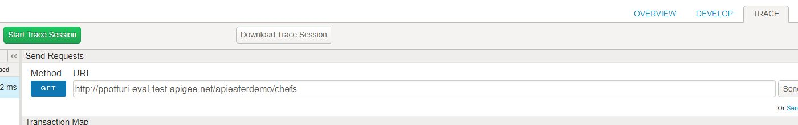

* http://<yourHostName>/apieaterdemo/chefs. Note to add /chefs path suffix in your test url

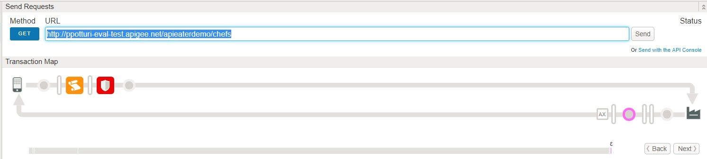


# Summary

This lab demonstrates how to use entrypted key value maps and basic authentication which invoking secured backends. By applying KVM you can use Apigee Edge to retrieve non-expiring data that shouldn't be hard-coded in your API proxy logic.

# References

[Working with Key Value Maps](https://docs.apigee.com/api-services/content/key-value-maps)

[key value map operations-policy](https://docs.apigee.com/api-services/reference/key-value-map-operations-policy)

