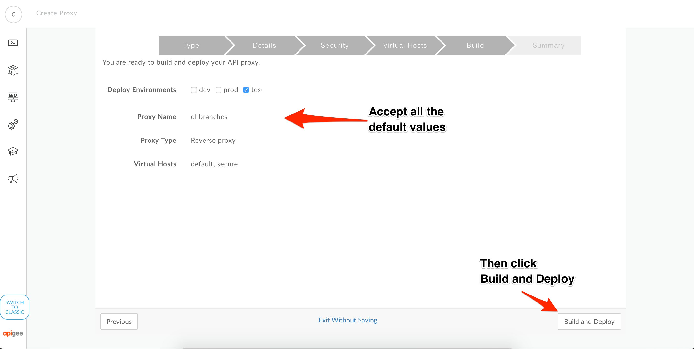
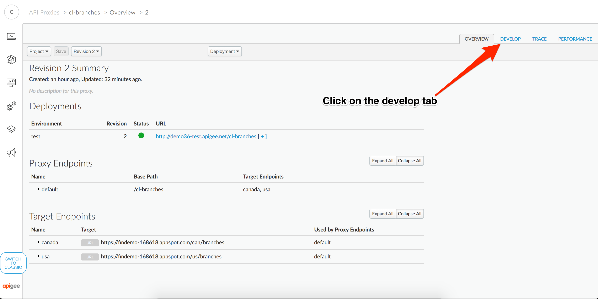
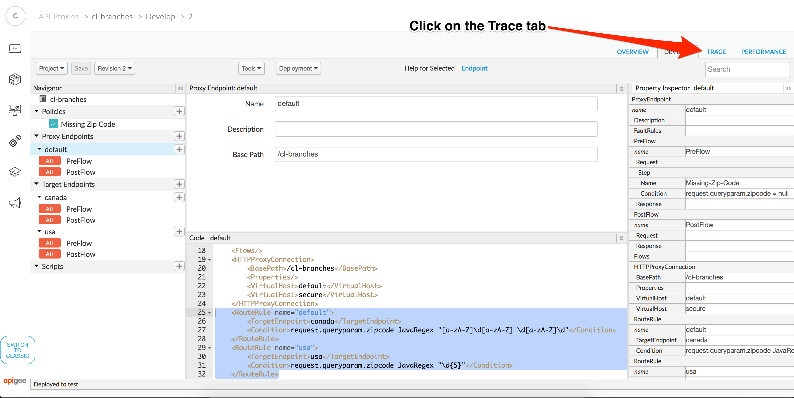
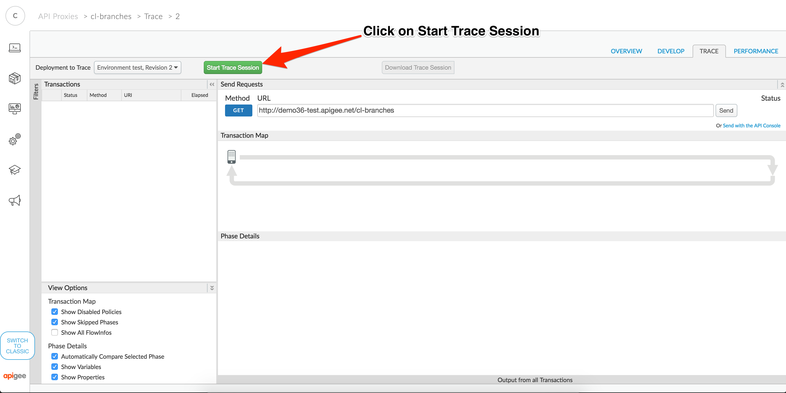

# API Development : Working with response cache

*Duration : 30 mins*

*Persona : API Team*

# Use case

Caches data from a backend resource, reducing the number of requests to the resource. As apps make requests to the same URI, you can use this policy to return cached responses instead of forwarding those requests to the backend server. The ResponseCache policy can improve your API's performance through reduced latency and network traffic.


# How can Apigee Edge help?

You'll likely find ResponseCache most useful when backend data used by your API is updated only periodically. For example, imagine you have an API that exposes weather report data refreshed only every ten minutes. By using ResponseCache to return cached responses between refreshes, you can decrease the number of requests reaching the backend. This also reduces the number of network hops.

# Context

In this lab, we'll build a API proxy using response cache policy

At end of this you will know
- What is response cache
- Using response cache in Api Proxy
- updating timeout parameters to verify that the response cache is cleared and backend is invoked

# Pre-requisites

None

# Instructions

* Go to [https://apigee.com/edge](https://apigee.com/edge) and log in. This is the Edge management UI. 

## Create a new API Proxy

* Open the Develop Menu from the left hand side navigation bar then click on the API Proxies menu item.


* Click on the +Proxy button in the upper right corner of the API proxy list panel


* In the new proxy creation wizard, select the Reverse Proxy option and then click on Next


* Enter values for Proxy Name, Proxy Base Path and Existing API. Click Next.


```
Proxy Name: {your initials}-responsecachedemo
Proxy Base Path: /{your initials}-responsecachedemo
Existing API: https://www.googleapis.com/books/v1/volumes
```

* Select the pass through option for Authorization then click Next.


* Accept all the default values for the Virtual Host configuration then click Next.


* Accept all the default values for the final configuration confirmation, then click Next.



* When the confirmation displays, click on the proxy name link to open a detailed view of your API proxy.


## Add Response Cache policy in API proxy

* Click on the develop tab on api proxy



* Add a new step in under proxy endpoint - PREFLOW


* select Reponse Cache policy from the drop down "TM-responseCache" then click on Add button as show below


* Update Timeoutinsec from default '3600' to '60', to notice the cache hit and cache expire scenarios


```
<?xml version="1.0" encoding="UTF-8" standalone="yes"?>
<ResponseCache async="false" continueOnError="false" enabled="true" name="TM-responseCache">
    <DisplayName>TM-responseCache</DisplayName>
    <Properties/>
    <CacheKey>
        <Prefix/>
        <KeyFragment ref="request.uri" type="string"/>
    </CacheKey>
    <Scope>Exclusive</Scope>
    <ExpirySettings>
        <ExpiryDate/>
        <TimeOfDay/>
        <TimeoutInSec ref="">60</TimeoutInSec>
    </ExpirySettings>
    <SkipCacheLookup/>
    <SkipCachePopulation/>
</ResponseCache>
```

* Save API proxy


## Test you API 

* Open the Trace Menu from the right hand side navigation bar 



* Then click on Start Trace Session



* Invoke API proxy by passing "?q=java" as query parameter

```
http://{yourHostName}/{your initials}-responsecachedemo?q=java. 

NOTE to pass query parameter "?q=java" in path suffix in your url

```


In the above trace you can notice that after the cache expiry, call went to backend to retrieve data and got persisted in cache for subsequent calls

# Summary

This lab demonstrates how to use response cache policy in Apigee. By using ResponseCache to return cached responses between refreshes, you can decrease the number of requests reaching the backend. This also reduces the number of network hops.

# References

[Working with ResponseCache Policy](https://docs.apigee.com/api-services/reference/response-cache-policy)
